# คำอธิบายโค้ด: หน้าโปรไฟล์ (Profile.jsx) และหน้าตั้งค่าโปรไฟล์ (SettingsProfile.jsx)

สองไฟล์นี้ทำงานคู่กัน:

- **`src/pages/Profile.jsx`** — หน้า "ดู" โปรไฟล์ (แบบ read-only ส่วนใหญ่) แสดงข้อมูล, โพสต์, แบบร่าง, บุ๊กมาร์ก, ความสำเร็จ
- **`src/pages/settings/SettingsProfile.jsx`** — หน้า "แก้ไข" โปรไฟล์ (ฟอร์ม) ที่เปลี่ยนข้อมูลแล้วไปโผล่ที่หน้า Profile.jsx

ทั้งสองไฟล์อ่านข้อมูล **user คนเดียวกัน** จาก `useAuthStore` (zustand) และข้อมูล **milestones คนเดียวกัน** จาก `useAchievementStore` เลยทำงานสอดคล้องกันโดยอัตโนมัติ — แก้ที่หน้าตั้งค่าแล้วหน้าโปรไฟล์อัปเดตตามทันทีโดยไม่ต้อง refresh

```mermaid
flowchart LR
    A[SettingsProfile.jsx<br/>ฟอร์มแก้ไข] -->|profileService.updateProfile| B[Backend API]
    A -->|login&#40;...&#41; อัปเดตทันที| C[authStore<br/>zustand]
    C -->|user| D[Profile.jsx<br/>หน้าแสดงผล]
    E[achievementStore] -->|milestones| A
    E -->|milestones| D
    F["/milestones API"] --> E
```

---

## 1. `SettingsProfile.jsx` — หน้าแก้ไขโปรไฟล์

### หน้าที่หลัก
ฟอร์มเดียวที่รวมการแก้ไขทุกอย่างของโปรไฟล์: รูป avatar, กรอบรูป, วอลเปเปอร์, แบนเนอร์, ชื่อเล่น, ระดับการศึกษา, bio และธีม (avatar shape) — พร้อมพรีวิวสดด้านขวา

### State หลักที่ใช้
| State | เก็บอะไร |
|---|---|
| `formData` | ชื่อเล่น, bio, ระดับการศึกษา, theme_settings — ข้อมูลที่ต้องกด "บันทึกข้อมูล" ถึงจะเซฟจริง |
| `media` | ไฟล์รูป avatar/wallpaper/banner ที่ผู้ใช้เพิ่งเลือก (ยังไม่ได้อัปโหลดจนกว่าจะกดบันทึก) |
| `isFrameModalOpen` | เปิด/ปิดป๊อปอัปเลือกกรอบรูป |

### การทำงานทีละส่วน

**โหลดข้อมูลเริ่มต้น** (`useEffect` บรรทัด ~95-107)
พอมี `user` จาก authStore ก็ดึงค่าปัจจุบันมาใส่ `formData` — ที่ต้องเอา `theme_settings` มา**ทั้งก้อน** (ไม่ใช่แค่ avatarShape) เพราะตอนกดบันทึกจะส่งทั้งก้อนไปทับของเดิม ถ้าดึงมาไม่ครบ ฟิลด์ที่ตั้งไว้ในหน้า "รูปลักษณ์" (Appearance) จะหายไป

**`handleFileChange(e, type)`** — ตอนเลือกไฟล์รูป
เช็คขนาดไฟล์ก่อน (avatar/banner ≤ 8MB, wallpaper ≤ 25MB), เช็คว่า wallpaper เป็นรูปภาพหรือวิดีโอ MP4 เท่านั้น แล้วสร้าง URL ชั่วคราวในเครื่อง (`URL.createObjectURL`) เพื่อโชว์พรีวิวทันทีโดยยังไม่อัปโหลดขึ้นจริง

**`handleEquipFrame(frameId)` / `handleEquipWallpaper(url)`** — กดใช้รางวัลทันที
สองฟังก์ชันนี้ **ไม่รอปุ่ม "บันทึกข้อมูล"** — พอผู้ใช้เลือกกรอบ/วอลเปเปอร์จากรางวัลที่ปลดล็อกแล้ว จะยิง API บันทึกทันที แล้วอัปเดต `authStore` ให้เห็นผลทันที (เหมือนวิธีที่หน้า Achievements ใช้ตอนกด "รับรางวัล")

**`handleSubmit(e)`** — ปุ่ม "บันทึกข้อมูล" หลัก
รวมข้อมูลฟอร์ม + ไฟล์ที่เลือกไว้ทั้งหมด ส่งไปที่ `profileService.updateProfile()` ทีเดียว ถ้าสำเร็จจะอัปเดต `authStore` ด้วยข้อมูลจริงจาก backend ถ้า backend error จะ**ตกไปโหมดจำลอง** (merge ค่าที่กรอกไว้เข้า authStore เลยโดยไม่รอ backend) เพื่อไม่ให้ผู้ใช้เสียงานที่แก้ไว้ ทั้งที่ backend endpoint บางตัวยังไม่เสร็จ

**`frameMilestones` / `claimedWallpapers`** (บรรทัด 43-46)
กรอง `milestones` จาก achievementStore มาเฉพาะที่เป็นรางวัลประเภท FRAME (ไปโชว์ในป๊อปอัปเลือกกรอบ) และประเภท WALLPAPER ที่ **CLAIMED แล้วเท่านั้น** (โชว์เป็นตัวเลือกด่วนใต้ช่องอัปโหลดวอลเปเปอร์) — ใช้ `?.` กันพังตอนบางภารกิจไม่มีรางวัลผูกไว้เลย (`reward: null`)

**พรีวิวสด** (`previewUser`, `previewFormData`)
รวมข้อมูล user จริง + ไฟล์ที่เพิ่งเลือกไว้ (ยังไม่บันทึก) เข้าด้วยกัน ส่งให้ `<ProfilePreview>` วาดเป็นภาพจำลองมือถือ ผู้ใช้เห็นผลลัพธ์ก่อนกดบันทึกจริง

---

## 2. `Profile.jsx` — หน้าแสดงผลโปรไฟล์

### หน้าที่หลัก
แสดงโปรไฟล์แบบเต็มหน้าจอ พร้อมพื้นหลัง (wallpaper) ของผู้ใช้เอง, การ์ดข้อมูลส่วนตัว, และแท็บ 4 อัน: โพสต์ / แบบร่าง / บุ๊กมาร์ก / ความสำเร็จ

### การทำงานทีละส่วน

**ระบบธีมพื้นหลังอัตโนมัติ (Hero theming)** — บรรทัด 66-93
หน้านี้พิเศษกว่าหน้าอื่นตรงที่มีพื้นหลังเต็มจอเป็นรูป/วิดีโอที่ผู้ใช้ตั้งเอง (`wallpaper_url`) แล้ว **วิเคราะห์ความสว่างของภาพนั้นอัตโนมัติ** ผ่าน `useHeroThemeStore` เพื่อตัดสินใจว่าตัวอักษร/การ์ด/navbar ควรเป็นโทนสว่างหรือมืด (`isDarkHero`) — สำคัญมากที่ต้อง `clearHeroImage()` ตอนออกจากหน้านี้ ไม่งั้นหน้าอื่นจะติดธีมมืดของหน้าโปรไฟล์ไปด้วย (ทำผ่าน cleanup function ใน `useEffect`)

จากนั้นตัวแปร class (`pageBg`, `cardBorderClass`, `headingClass`, ฯลฯ) ทั้งหมดจะสลับไปมาตาม `isDarkHero` ตัวเดียว ทำให้ทั้งหน้าเปลี่ยนโทนสีพร้อมกันหมด

**หน้าจอ "เข้าสู่โปรไฟล์" (Enter screen)** — บรรทัด 178-206
ถ้าผู้ใช้เปิดฟีเจอร์ `enter_screen_enabled` ไว้ (ตั้งค่าได้จากหน้า Appearance) จะมีหน้าจอทักทายพร้อมข้อความที่ตั้งเองก่อน ต้องกด "เข้าสู่โปรไฟล์" ถึงจะเห็นเนื้อหาจริง — เป็น gate ง่ายๆ ด้วย state `hasEntered`

**โหลดข้อมูลโปรไฟล์** (`loadProfileData`, บรรทัด 141-176)
ดึงโพสต์ของตัวเอง, แบบร่าง, บุ๊กมาร์ก, และข้อมูลโปรไฟล์สาธารณะ (สำหรับนับผู้ติดตาม) **พร้อมกันทีเดียว** ด้วย `Promise.all` ตอนเปิดหน้า/เปลี่ยน user

**แท็บ "ความสำเร็จ"** (บรรทัด 631-708)
ต่างจากหน้า Achievements ตรงที่แท็บนี้เป็น**หน้าดูอย่างเดียว ไม่มีปุ่มกดรับรางวัล** — แสดงเฉพาะภารกิจที่ทำสำเร็จแล้ว (`status !== "LOCKED"`, รวมทั้ง READY_TO_CLAIM และ CLAIMED) ส่วนที่ยังไม่ปลดล็อกจะไม่โชว์ในนี้เลย

การ์ดแต่ละใบเช็ค `m.reward` ก่อนเสมอ (`m.reward?.type`, `{m.reward && (...)}`) เพราะภารกิจจริงจาก backend **อาจไม่มีรางวัลผูกไว้เลยก็ได้** (ไม่เหมือนข้อมูลจำลองเดิมที่ทุกภารกิจมีรางวัลเสมอ) — ถ้าลืมเช็คจุดนี้จะทำให้ทั้งแอปพัง (หน้าขาว) เหมือนที่เคยเจอมาแล้ว

---

## 3. จุดเชื่อมต่อสำคัญระหว่างสองไฟล์

1. **`authStore` (user)** — `SettingsProfile.jsx` เรียก `login({...})` ทุกครั้งที่บันทึกสำเร็จ (ทั้งฟอร์มหลักและปุ่มเปลี่ยนกรอบ/วอลเปเปอร์แบบเร็ว) ทำให้ `Profile.jsx` เห็นข้อมูลใหม่ทันทีโดยไม่ต้องโหลดหน้าใหม่ เพราะทั้งคู่ subscribe storeตัวเดียวกัน
2. **`achievementStore` (milestones)** — ทั้งสองไฟล์เรียก `fetchMilestones()` ตอนเปิดหน้า และอ่าน `milestones` ตัวเดียวกัน (ข้อมูลจริงจาก `GET /milestones`) — `SettingsProfile.jsx` ใช้เพื่อโชว์ตัวเลือกกรอบ/วอลเปเปอร์ที่ปลดล็อกแล้ว, `Profile.jsx` ใช้เพื่อโชว์สรุปความสำเร็จทั้งหมด
3. **`profileService.updateProfile()`** — จุดเดียวที่ทั้งฟอร์มใหญ่และปุ่ม equip แบบเร็วเรียกใช้ร่วมกันในการบันทึกข้อมูลลง backend
