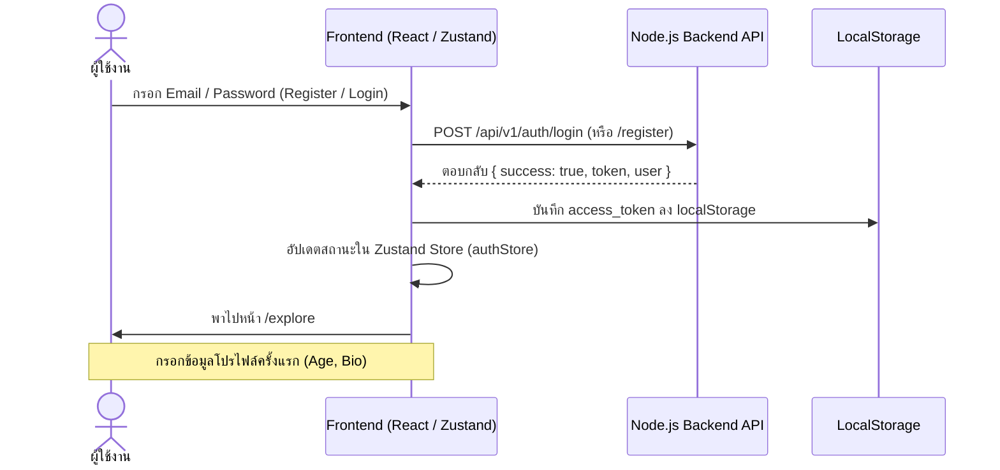
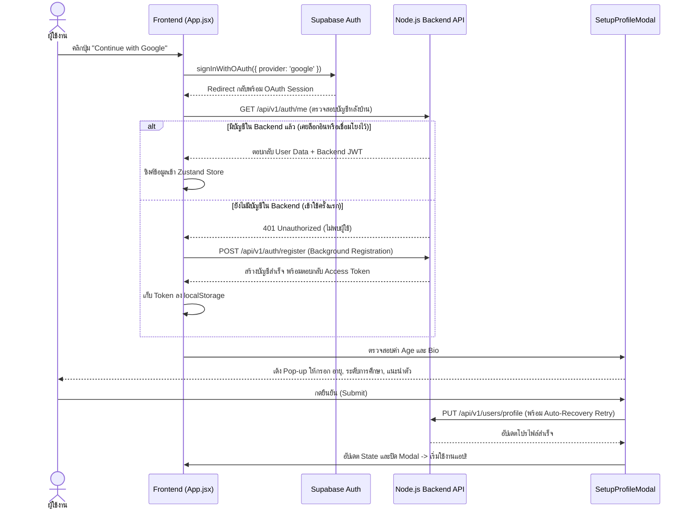

# 🎓 SHARE-ED Frontend: Authentication System & Architecture

ยินดีต้อนรับสู่คู่มือระบบยืนยันตัวตน (Authentication Feature) ของโปรเจกต์ **SHARE-ED** แพลตฟอร์มการแบ่งปันความรู้และสื่อการเรียนรู้ ระบบยืนยันตัวตนของเราถูกออกแบบด้วยสถาปัตยกรรม **Hybrid Authentication & Account Syncing** เพื่อความปลอดภัย ความเร็ว และประสบการณ์ผู้ใช้งาน (UX) ที่ราบรื่นที่สุด

---

## 🌟 คุณสมบัติเด่น (Key Features)

### 1. 🔐 Multi-Channel Login & Registration (รองรับการเข้าสู่ระบบหลายช่องทาง)

- **Email & Password Authentication**: สมัครสมาชิกและเข้าสู่ระบบด้วยอีเมลและรหัสผ่าน ผ่าน Node.js Express Backend API มีระบบตรวจสอบความครบถ้วนของข้อมูลและ Validation ที่รัดกุม
- **Google OAuth 2.0 (via Supabase)**: เข้าสู่ระบบอย่างรวดเร็วด้วยบัญชี Google โดยใช้ Supabase Auth ร่วมกับการซิงค์ข้อมูลกับ Backend อัตโนมัติ

### 2. 🤝 Smart Account Linking (การเชื่อมโยงบัญชีอัจฉริยะ)

- หากผู้ใช้งานเคยสมัครสมาชิกผ่าน Email/Password ไว้แล้ว และกดล็อกอินด้วย Google OAuth ในภายหลังโดยใช้อีเมลเดียวกัน ระบบจะทำการเชื่อมโยงบัญชี (Account Linking) เข้าด้วยกันทันที ไม่สร้างบัญชีซ้ำซ้อน และดึงโปรไฟล์เดิมมาใช้งานได้ต่อเนื่อง

### 3. 🎯 First-Time Profile Setup Modal (บังคับกรอกข้อมูลโปรไฟล์ครั้งแรกแบบ Modal)

- สำหรับผู้ใช้งานใหม่ที่เพิ่งลงทะเบียน หรือเข้าใช้งานผ่าน Google เป็นครั้งแรก ระบบจะแสดงหน้าต่าง Pop-up Modal ([SetupProfileFirstTime.jsx](file:///c:/Users/cusmi/OneDrive/Bureau/SHARE-ED_Frontend/src/components/SetupProfileFirstTime.jsx)) โดยอัตโนมัติเมื่อเข้าสู่หน้าแอปพลิเคชัน
- บังคับให้ระบุข้อมูลพื้นฐานที่จำเป็นต่อการใช้งานในชุมชน:
  - **อายุ (Age)**
  - **ระดับการศึกษา (Education Level)**: มัธยมต้น, มัธยมปลาย, ปริญญาตรี, ฯลฯ
  - **แนะนำตัวสั้น ๆ (Bio)**
- **Smart Validation**: หากโปรไฟล์สมบูรณ์แล้ว Modal จะปิดลงและไม่มารบกวนผู้ใช้งานอีก

### 4. ⚙️ Smart Auto-Recovery & Background Token Exchange

- เพื่อแก้ข้อจำกัดและปัญหาระหว่าง Supabase Token และ Node.js Backend JWT ระบบได้ฝังกลไก **Background Token Exchange**:
  - เมื่อผู้ใช้งานล็อกอินผ่าน Google ระบบใน [App.jsx](file:///c:/Users/cusmi/OneDrive/Bureau/SHARE-ED_Frontend/src/App.jsx) จะตรวจสอบฐานข้อมูลหลังบ้านทันที (`/auth/me`)
  - หากเป็นบัญชี Google ใหม่ที่ยังไม่มีฐานข้อมูลใน Node.js Backend ระบบจะลงทะเบียนเข้าสู่ระบบหลังบ้านให้โดยอัตโนมัติ (Background Registration) พร้อมรับ Access Token เก็บลง `localStorage` ทันที
  - ป้องกันปัญหา `401 Unauthorized` และ `403 Forbidden` เมื่อเข้าถึงหน้า Profile หรือสร้างโพสต์
  - หากการบันทึกข้อมูลโปรไฟล์ครั้งแรกติดปัญหาเซสชัน โค้ดใน [SetupProfileFirstTime.jsx](file:///c:/Users/cusmi/OneDrive/Bureau/SHARE-ED_Frontend/src/components/SetupProfileFirstTime.jsx) จะทำการ **Auto-Recovery** สร้าง Token ใหม่และส่งคำสั่งอัปเดตให้อัตโนมัติ โดยไม่เด้งผู้ใช้ออกจากระบบ

### 5. 🛡️ Global Token Management & Smart Interceptor

- จัดการ Token ผ่าน Axios Interceptors ([src/utils/api.js](file:///c:/Users/cusmi/OneDrive/Bureau/SHARE-ED_Frontend/src/utils/api.js)): แนบ `Authorization: Bearer <token>` ในทุกรีเควสอัตโนมัติ
- **Smart 401 Interceptor**: หาก Token หมดอายุ ระบบจะล้าง Token และ Logout อัตโนมัติ _ยกเว้น_ คำสั่งในกลุ่มตรวจสอบบัญชีหรือกำลังกรอกโปรไฟล์ครั้งแรก (`/auth/me`, `/auth/register`, `/users/profile`) เพื่อให้กลไก Auto-Recovery ทำงานได้สมบูรณ์แบบ

---

## 🔄 สถาปัตยกรรมและ Flow การทำงาน (Authentication Flows)

### Flow 1: การเข้าสู่ระบบด้วย Email & Password (Standard Auth)



### Flow 2: การเข้าสู่ระบบด้วย Google OAuth & Onboarding



---

## 📂 โครงสร้างไฟล์สำคัญ (Key Files & Directory Structure)

| ชื่อไฟล์ / ตำแหน่ง                                                                                                                            | หน้าที่และความสำคัญ                                                                                                                                           |
| :-------------------------------------------------------------------------------------------------------------------------------------------- | :------------------------------------------------------------------------------------------------------------------------------------------------------------ |
| [src/App.jsx](file:///c:/Users/cusmi/OneDrive/Bureau/SHARE-ED_Frontend/src/App.jsx)                                                           | **Auth Orchestrator**: ดักจับสถานะ Supabase Session, ตรวจสอบและซิงค์บัญชีกับ Node.js Backend อัตโนมัติในตอนเปิดเว็บ และควบคุมการแสดงผลของ Setup Profile Modal |
| [src/pages/Login.jsx](file:///c:/Users/cusmi/OneDrive/Bureau/SHARE-ED_Frontend/src/pages/Login.jsx)                                           | หน้าฟอร์มเข้าสู่ระบบด้วย Email/Password รองรับการอ่าน Token ทุกรูปแบบจาก Backend และจัดการ Routing                                                            |
| [src/pages/Register.jsx](file:///c:/Users/cusmi/OneDrive/Bureau/SHARE-ED_Frontend/src/pages/Register.jsx)                                     | หน้าฟอร์มสมัครสมาชิกใหม่ พร้อมระบบ Validation และเชื่อมต่อไปยังหน้า Login หรือเข้าสู่ระบบทันที                                                                |
| [src/components/SetupProfileFirstTime.jsx](file:///c:/Users/cusmi/OneDrive/Bureau/SHARE-ED_Frontend/src/components/SetupProfileFirstTime.jsx) | **Onboarding Modal**: หน้าต่าง Pop-up บังคับกรอกข้อมูลครั้งแรก พร้อมระบบ Smart Auto-Recovery ที่คอยอัปเดตข้อมูลทั้งใน Mongoose Backend และ Supabase           |
| [src/store/authStore.js](file:///c:/Users/cusmi/OneDrive/Bureau/SHARE-ED_Frontend/src/store/authStore.js)                                     | **Global State**: Zustand Store สำหรับจัดเก็บข้อมูล `user` และสถานะ `isAuthenticated` ให้ทุก Component เข้าถึงได้ทันที                                        |
| [src/services/auth.service.js](file:///c:/Users/cusmi/OneDrive/Bureau/SHARE-ED_Frontend/src/services/auth.service.js)                         | สื่อสารกับ REST API (`/auth/login`, `/auth/register`, `/auth/me`) ของ Node.js Backend                                                                         |
| [src/utils/api.js](file:///c:/Users/cusmi/OneDrive/Bureau/SHARE-ED_Frontend/src/utils/api.js)                                                 | Axios Instance พร้อมตัวดักจับ (Interceptors) สำหรับแนบ Token และจัดการ Error 401 อย่างชาญฉลาด ไม่เตะผู้ใช้ออกระหว่าง Setup Profile                            |
| [src/utils/supabase.js](file:///c:/Users/cusmi/OneDrive/Bureau/SHARE-ED_Frontend/src/utils/supabase.js)                                       | ตั้งค่า Supabase Client สำหรับจัดการ Google OAuth                                                                                                             |

---

## 🛠️ การตั้งค่า Environment Variables (`.env`)

ในการรันระบบ Authentication ให้ทำงานได้อย่างสมบูรณ์ ต้องกำหนดค่าตัวแปรในไฟล์ `.env` หรือ `.env.local` ดังนี้:

```env
# URL ของเซิร์ฟเวอร์หลังบ้าน (Node.js Express API)
VITE_API_BASE_URL=https://share-ed-backend-6jer.onrender.com/api/v1

# Supabase Configuration สำหรับ Google OAuth
VITE_SUPABASE_URL=https://bzxlqtzspmtnpibfsuei.supabase.co
VITE_SUPABASE_ANON_KEY=your_supabase_anon_key_here
```

---

## 🚀 การรันโปรเจกต์ (Getting Started)

1. **ติดตั้ง Dependencies:**
   ```bash
   npm install
   ```
2. **รันเซิร์ฟเวอร์สำหรับพัฒนา (Development Server):**
   ```bash
   npm run dev
   ```
3. เปิดเบราว์เซอร์ไปที่ `http://localhost:5173` เพื่อเริ่มต้นใช้งานและทดสอบระบบ Authentication!
