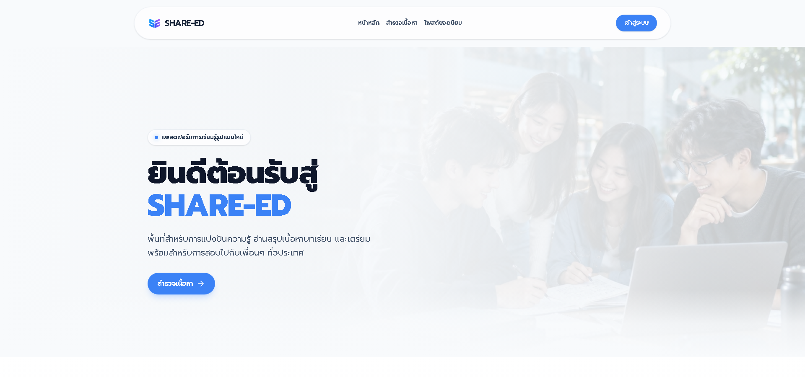
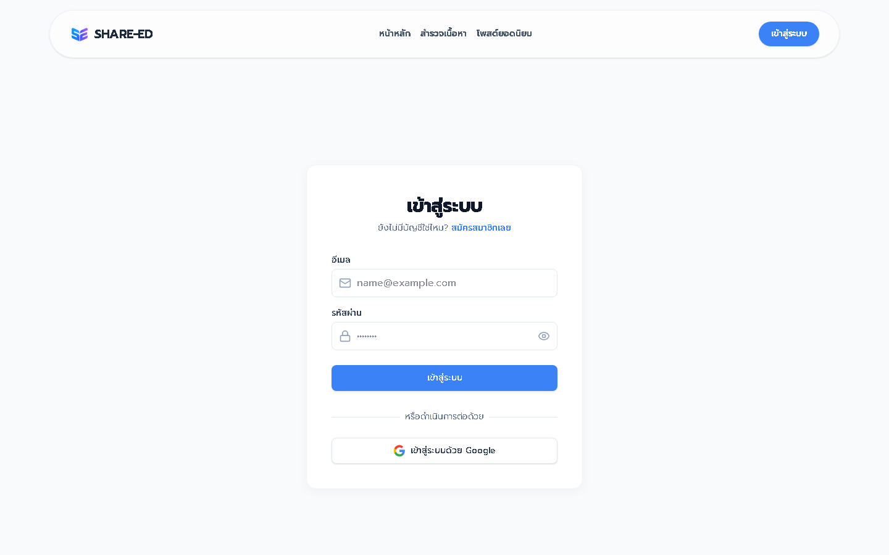
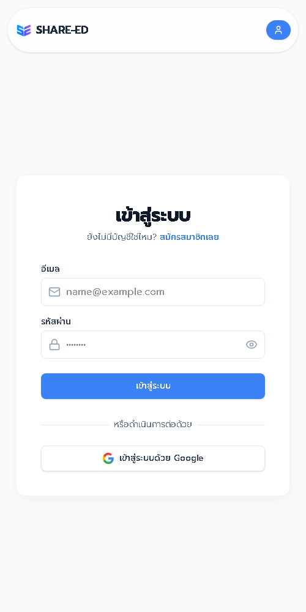

<p align="right">
  <a href="README.md">English</a> | <strong>ไทย</strong>
</p>

<div align="center">
  

  # SHARE-ED

  **พื้นที่แบ่งปันความรู้ สื่อการเรียน และประสบการณ์สำหรับผู้เรียนทุกระดับ**

  [](package.json)
  [](package.json)
  [](package.json)
  [](src/store)
</div>

SHARE-ED คือเว็บแอปพลิเคชันชุมชนการเรียนรู้สำหรับเผยแพร่ ค้นหา และแลกเปลี่ยนสื่อการศึกษา ผู้ใช้สามารถสร้างโพสต์พร้อมรูปภาพหรือ PDF ติดตามผู้สร้างเนื้อหา โต้ตอบกับโพสต์ และสะสมความสำเร็จได้ภายในแพลตฟอร์มเดียว

## สารบัญ

- [ภาพตัวอย่างโปรเจกต์](#ภาพตัวอย่างโปรเจกต์)
- [SHARE-ED ทำอะไรได้บ้าง](#share-ed-ทำอะไรได้บ้าง)
- [เริ่มต้นใช้งาน](#เริ่มต้นใช้งาน)
- [โครงสร้างโปรเจกต์](#โครงสร้างโปรเจกต์)
- [Tech Stack](#tech-stack)
- [Contributors](#contributors)
- [Commit Distribution](#commit-distribution)
- [License](#license)

## ภาพตัวอย่างโปรเจกต์

### หน้า Home

<p align="center">
  
</p>

### หน้า Login

<p align="center">
  
</p>

### Responsive Preview

<table>
  <tr>
    <th width="50%">Home — Mobile</th>
    <th width="50%">Login — Mobile</th>
  </tr>
  <tr>
    <td align="center">
      
    </td>
    <td align="center">
      
    </td>
  </tr>
</table>

## SHARE-ED ทำอะไรได้บ้าง

### ระบบสมาชิกและโปรไฟล์

- สมัครสมาชิก เข้าสู่ระบบ ยืนยันอีเมล และรีเซ็ตรหัสผ่านผ่าน Supabase Auth
- แก้ไขข้อมูลส่วนตัว รูปโปรไฟล์ ธีมพื้นหลัง และกรอบตกแต่ง
- เพิ่มวิดเจ็ตลิงก์ภายนอกลงในหน้าโปรไฟล์
- ติดตามผู้ใช้อื่นและดูรายชื่อผู้ติดตาม

### ระบบเนื้อหา

- สร้าง แก้ไข และบันทึกโพสต์เป็นฉบับร่าง
- เขียนเนื้อหาด้วย Rich Text Editor
- แนบหน้าปก รูปภาพ และไฟล์ PDF
- ค้นหาและกรองโพสต์ตามระดับการศึกษา หมวดหมู่ และแท็ก
- ดูโพสต์ล่าสุดในหน้า Home และโพสต์ยอดนิยมในหน้า Trending

### Social และ Realtime

- กดถูกใจ บันทึกโพสต์ และแสดงความคิดเห็น
- รายงานเนื้อหาที่ไม่เหมาะสม
- รับการแจ้งเตือนผ่าน Socket.IO แบบ realtime
- ติดตามความสำเร็จ รับรางวัล และเลือกใช้กรอบโปรไฟล์

### ระบบผู้ดูแล

- จัดการบัญชีและสิทธิ์ของผู้ใช้งาน
- ตรวจสอบรายงาน ระงับ กู้คืน หรือลบโพสต์
- จัดการ Achievement, milestone และรายการรางวัล

## เริ่มต้นใช้งาน

### สิ่งที่ต้องมี

- [Node.js](https://nodejs.org/) `^20.19.0` หรือ `>=22.12.0`
- npm
- SHARE-ED Backend API
- โปรเจกต์ Supabase สำหรับ Authentication

### 1. ติดตั้ง Dependencies

```bash
git clone https://github.com/siwakornkleebmekdev/share_ed_frontend.git
cd share_ed_frontend
npm install
```

### 2. ตั้งค่า Environment Variables

สร้างไฟล์ `.env.local` ภายในโฟลเดอร์ `share_ed_frontend`:

```dotenv
VITE_API_BASE_URL=http://localhost:5000/api/v1
VITE_SUPABASE_URL=https://YOUR_PROJECT.supabase.co
VITE_SUPABASE_ANON_KEY=YOUR_ANON_KEY
VITE_DIRECT_UPLOAD_ENABLED=true
```

| Variable | รายละเอียด |
|---|---|
| `VITE_API_BASE_URL` | Base URL ของ Backend REST API |
| `VITE_SUPABASE_URL` | URL ของโปรเจกต์ Supabase |
| `VITE_SUPABASE_ANON_KEY` | Public anonymous key ของ Supabase |
| `VITE_DIRECT_UPLOAD_ENABLED` | เปิดการอัปโหลดไฟล์ตรงไปยัง Storage provider |

### 3. เปิด Development Server

```bash
npm run dev
```

เปิดเว็บไซต์ที่ `http://localhost:5173`

### คำสั่งที่ใช้บ่อย

| คำสั่ง | รายละเอียด |
|---|---|
| `npm run dev` | เปิด Vite development server |
| `npm run build` | สร้าง production build ใน `dist/` |
| `npm run lint` | ตรวจโค้ดด้วย Oxlint |
| `npm run preview` | ทดลอง production build ในเครื่อง |

### รันด้วย Docker

คัดลอกไฟล์ environment ตัวอย่างและกำหนดค่าของโปรเจกต์ก่อน build:

```bash
cp .env.example .env
docker compose up --build -d
```

สำหรับ PowerShell ใช้ `Copy-Item .env.example .env` แทนคำสั่ง `cp`

เปิดเว็บไซต์ที่ `http://localhost:5173` และหยุดระบบด้วย:

```bash
docker compose down
```

หาก port `5173` ถูกใช้งานอยู่ สามารถกำหนด `FRONTEND_PORT` ในไฟล์ `.env` เป็น port อื่นได้

## โครงสร้างโปรเจกต์

```text
share_ed_frontend/
├── public/                       # Static assets และโลโก้
├── src/
│   ├── assets/                   # รูปภาพและสื่อของ UI
│   ├── components/               # Reusable UI components
│   │   ├── admin/                # Components สำหรับผู้ดูแลระบบ
│   │   ├── posts/                # Editor และ upload workspace
│   │   ├── profile/              # Components หน้าโปรไฟล์
│   │   └── settings/             # Components หน้าตั้งค่า
│   ├── constants/                # ค่าคงที่ของแอป
│   ├── hooks/                    # Custom React hooks
│   ├── layouts/                  # Main, Settings และ Admin layouts
│   ├── pages/                    # Route-level pages
│   │   ├── admin/                # หน้าจัดการระบบ
│   │   └── settings/             # หน้าตั้งค่าผู้ใช้
│   ├── services/                 # API service layer
│   ├── store/                    # Zustand stores
│   ├── utils/                    # API, Socket, Storage และ helpers
│   ├── App.jsx                   # Routes และ route guards
│   ├── App.css                   # App-level styles
│   ├── index.css                 # Global styles
│   └── main.jsx                  # Application entry point
├── tests/                        # Frontend tests
├── index.html                    # HTML entry point
├── package.json                  # Scripts และ dependencies
├── tailwind.config.js            # Tailwind configuration
├── vercel.json                   # Vercel deployment configuration
└── vite.config.js                # Vite configuration
```

## Tech Stack

<p align="center">
  
</p>

| กลุ่ม | Technology |
|---|---|
| Core | React 19, React DOM 19, Vite 8 |
| Routing | React Router 8 |
| Styling | Tailwind CSS 4, PostCSS, Autoprefixer |
| Icons | Lucide React, React Icons |
| State Management | Zustand 5 |
| API | Axios, Supabase JavaScript SDK |
| Realtime | Socket.IO Client |
| Editor | React Quill New |
| Notifications | React Hot Toast, SweetAlert2 |
| Code Quality | Oxlint |
| Deployment | Vercel และ Docker Compose configuration |

## Contributors

<table>
  <tr>
    <td align="center">
      <a href="https://github.com/siwakornkleebmekdev">
        <br />
        <sub><b>siwakornkleebmekdev</b></sub>
      </a>
    </td>
    <td align="center">
      <a href="https://github.com/kasuya21">
        <br />
        <sub><b>kasuya21</b></sub>
      </a>
    </td>
    <td align="center">
      <a href="https://github.com/Kittipong001">
        <br />
        <sub><b>Kittipong001</b></sub>
      </a>
    </td>
    <td align="center">
      <a href="https://github.com/eyejangg">
        <br />
        <sub><b>eyejangg</b></sub>
      </a>
    </td>
  </tr>
</table>

## Commit Distribution

สถิติจาก Git history ของ Frontend ณ วันที่ 1 ตุลาคม 2026 โดยรวมชื่อและอีเมลที่เป็นบุคคลเดียวกัน

| Contributor | Commits | สัดส่วน |
|---|---:|---:|
| `siwakornkleebmekdev` / Siwakorn | **153** | 53.1% |
| `kasuya21` / Thunva | **76** | 26.4% |
| `Kittipong001` / Kittipong | **36** | 12.5% |
| `eyejangg` | **23** | 8.0% |
| **รวม** | **288** | **100%** |

> จำนวน commit อาจเปลี่ยนแปลงเมื่อมีการ merge, rebase หรือเพิ่ม commit ใหม่

## License

ขณะนี้ repository ยังไม่ได้ระบุ license สำหรับการนำโค้ดไปใช้ซ้ำหรือเผยแพร่ต่อ กรุณาติดต่อทีมพัฒนาก่อนนำไปใช้งานภายนอก

<div align="center">
  Made with 💙 by the SHARE-ED team
</div>
